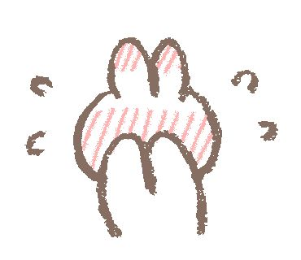

<html lang="en">

<head>
    <meta charset="UTF-8">
    <meta name="viewport" content="width=device-width, initial-scale=1.0">
    <title>About my Crush</title>
    
</head>

<body>
    <header>
        <h1>
I'ma tell you about my Crush
</h1>
    </header>

    <main>
        
Ok! Let me tell you about my crush before when I was 7th grade. Well uhh, 
            I’ve been crushing this person for a very long time ago. I’m so inlove with that person. 
            I can’t even stop thinking about that human being..

        
It's like gusto ko siyang makita araw-araw, makausap, makipag hangout sakaniya
            pero I don't have any courage to do it.

        

        
I'm so inlove with that person talaga nung grade 7, tumibok talaga ang puso ko sakaniya, but then suddenly
            nag ka covid at ayun na nga 'yun COVID-19 PANDEMIC.So hindi ko siya nakita nang matagal na panahon at 
            siyempre while the time is ticking nag kakaroon din naman ako ng ibat-ibang friends sa social media, 
            I've met alota people galing sa ibat-ibang bansa that's how technology works nowadays.

            
 At ayun na nga mag kakaroon na kami ng klase non, halos nawawala na din naman ang issue 
                tungkol sa covid-19 na'to na pumaslang ng maraming tao. At nung pumasok na ako sa paaralan 
                siyempre nakikita ko siya at ayun bumalik na uli ang pag tingin ko sakaniya. 

                
 May nakikita naman akong signs na what if gusto niya rin ako mga 1 week straight din
                    'yun nong nag pakita siya sakin ng motiba na gusto niya ako HAHAH o ako lang tong assuming talaga HAHA!.
                

                

            
But unfortunately, I found out na may karibal ako HAHA! I don't know if I'm the only one na kapag may nag ka
            gusto sa crush ko is parang mawawalan na'ko ng gana kasi may kaagaw ako eh HEHE!. Ayun siyempre ako naman tong si assuming
            nag iisip na ay baka ako ang gusto non parang pinipilit ko sa isipan kong baka crush niya talaga ako?

            

        
Hindi talaga maawala ang pangalan niya sa isip at sa dila ko, like paano? Ket nga nasa panaginip pumapasok siya 
    pa'no to? I also remember na sinabi ko sa mga trusted ko lang na kaibigan ang tungkol rito about sa crush ko at ayun 
support naman sila pero I kinda also regreted it kasi baka may mag spill, ewan ko nga why do I easily trust someone even 
I don't need to?

 at ayun na na nga dikit ng dikit sakaniya ang nag kaka crush sa kaniya na'yun and also ako yung tipong tao na once
    mag ka gusto ako sa isang tao parang di ko na pinapansin pag katapos kasi parang nakaka awkward para sakin oo! HAHA!

        <h4> Chapter 2</h4>

        
 So ayun na nga nung nalaman kong nag kaka roon na sila ng conversation ng nag kaka crush sakaniya non, parang
            binitawan ko na ang pag kaka crush ko sakaniya, I stalked them HAHA! So ayun inancrush ko siya, bumalik ulit,
            inuncrush, bumalik ulit, and so on.
        

        
 So ayun na nga yeey! Grade 11 na ako, siyempre naka silent mode pa ako non, hindi ko pa kasi halos kilala
            mga bagong kaklase ko non eh, edi siyempre pakitang tao muna kahit halimaw naman HAHAHA! So ayun nag kakilala kami ng
            mga kaklase ko, naging close kami at ayun parati na kaming nag-uusap. And there's also one person who caught my attention,
            I don't wanna mention yung pangalan niya but this person really makes my hear beats so fast! WHAT THE HECK!!!!
            PLEASE CAN SOMEONE HELP ME!!!!!
        

        

        
 Gusto ko ang pag ka tao niya, nice naman pero una lang pala 'yun HAHA, ewan ko nga eh so naging crush ko din 'to
            ng matagal din. I also posted some rants in my freedom wall sa fb pero naka only me so ako lang pwede makakita non HAAHA!
            So ayun nga naging crush ko siya ng napakatagal until parang gusto ko sakaniya sabihin ang nararamdaman ko pero ayun 
            unti naunahan na ako HAHAHA! Ipinaubaya ko nga lang din siya sa iba baka naman meron pa talagang perfect time and perfect
            love para sa'kin. Hindi ko naman minamadali eh, ang importante muna ngayon is yung academics ko at ang dignidad ko.
        

        
At sana naman dapat sa nag babasa, huwag madaliin ang pag jowa ha? Piliin muna natin ang sarili natin at nag papasaya 
            sa'tin at makaka tulong sa'tin sa future. Kasi ang pag pili sa sarili mo ay tiyak walang pag sisisihan sa huli
            at upang maka tulong naman tayo sa magulang natin ^^
        

        <strong> IF YOU WANT TO KNOW MORE ABOUT ME JUST DON'T HESITATE TO REACH ME OUT AT</strong>
    

    <strong>Email:</strong> 
 lesterrustro13@gmail.com

    <b> Facebook:</b> Lester Rustro

    

    

    

      
 Thank you so much for reading! hope you gain a lil' bit of knowledge to this story.

